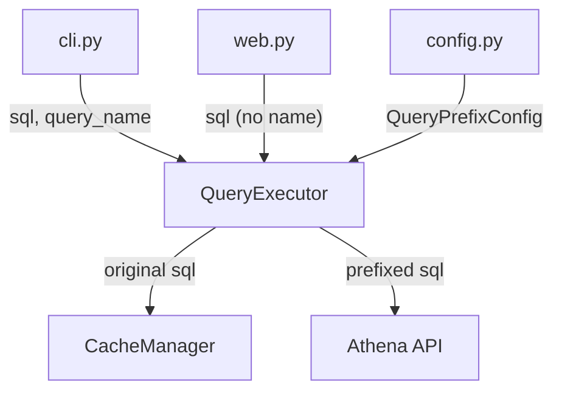

# Design Document: Query Comment Prefix

## Overview

This feature adds a SQL line comment prefix to every query submitted by the Athena Query Tool before it reaches the Athena API. The comment takes the form `-- [<tool_name>]\n` or `-- [<tool_name>] query_name=<name>\n`, making every query attributable in Athena's query history.

The prefix is injected at the `QueryExecutor` layer — the single point through which all SQL flows (CLI and Web). Cache lookups and storage continue to use the original, un-prefixed SQL so caching behaviour is unaffected.

The tool name defaults to `athena-query-tool` but can be overridden via a new optional `query_prefix.tool_name` field in the YAML configuration.

## Architecture

The change is localised to two modules:

1. **`config.py`** — parse and validate the new `query_prefix` configuration section.
2. **`executor.py`** — build the comment string and prepend it to the SQL immediately before calling `start_query_execution`.

No changes are required in `cli.py`, `web.py`, or `cache.py`. The executor already sits between all callers and the Athena API, so a single modification point guarantees consistent behaviour across execution paths.



### Design Decisions

1. **Prefix at executor, not caller** — Centralising the prefix in `QueryExecutor._submit_query` avoids duplicating logic in CLI and Web paths and guarantees every query is prefixed.
2. **Cache key uses original SQL** — The prefix is purely for observability; it must not invalidate or fragment the cache. `execute_query` already passes the raw `sql` to `CacheManager` before prefixing happens in `_submit_query`.
3. **Pure function for prefix building** — A standalone `build_query_prefix` function (or method) makes the formatting independently testable without needing an Athena client.

## Components and Interfaces

### New: `QueryPrefixConfig` dataclass (`config.py`)

```python
@dataclass
class QueryPrefixConfig:
    tool_name: str = "athena-query-tool"
```

Added as a field on the existing `Config` dataclass:

```python
@dataclass
class Config:
    aws: AWSConfig
    athena: AthenaConfig
    cache: CacheConfig
    output: OutputConfig
    queries: List[QueryConfig]
    query_prefix: QueryPrefixConfig   # NEW
```

### New: `_parse_query_prefix_config` static method (`config.py`)

Parses the optional `query_prefix` section from the YAML dict. If the section is absent, returns the default `QueryPrefixConfig()`. If `tool_name` is present but empty, raises `ConfigurationError`.

### Modified: `QueryExecutor.__init__` (`executor.py`)

Accepts an additional `query_prefix_config: QueryPrefixConfig` parameter (with a sensible default) and stores it.

### New: `QueryExecutor._build_prefix(query_name: Optional[str] = None) -> str` (`executor.py`)

Pure method that returns the comment string:

```python
def _build_prefix(self, query_name: Optional[str] = None) -> str:
    if query_name:
        return f"-- [{self.query_prefix_config.tool_name}] query_name={query_name}\n"
    return f"-- [{self.query_prefix_config.tool_name}]\n"
```

### Modified: `QueryExecutor.execute_query` (`executor.py`)

Signature gains an optional `query_name: Optional[str] = None` parameter. The method:

1. Uses the original `sql` for cache lookup/storage (unchanged).
2. Calls `_build_prefix(query_name)` and prepends the result to `sql` before passing to `_submit_query`.

### Modified: CLI loop (`cli.py`)

Passes `query_config.name` as `query_name` when calling `executor.execute_query`.

### Modified: Web route (`web.py`)

Calls `executor.execute_query(sql)` without a `query_name` (already the default).

## Data Models

### `QueryPrefixConfig`

| Field       | Type  | Default                | Validation                          |
|-------------|-------|------------------------|-------------------------------------|
| `tool_name` | `str` | `"athena-query-tool"`  | Must be a non-empty string if provided |

### YAML configuration extension

```yaml
# Optional section
query_prefix:
  tool_name: my-custom-tool   # defaults to "athena-query-tool" if omitted
```

### Prefix format

| Scenario              | Output                                              |
|-----------------------|-----------------------------------------------------|
| No query name         | `-- [athena-query-tool]\n`                           |
| With query name       | `-- [athena-query-tool] query_name=sample_query\n`   |
| Custom tool name      | `-- [my-custom-tool]\n`                              |
| Custom + query name   | `-- [my-custom-tool] query_name=sample_query\n`      |


## Correctness Properties

*A property is a characteristic or behavior that should hold true across all valid executions of a system — essentially, a formal statement about what the system should do. Properties serve as the bridge between human-readable specifications and machine-verifiable correctness guarantees.*

### Property 1: Prefix format correctness

*For any* SQL string, *for any* non-empty tool name, and *for any* optional query name (either a non-empty string or None), calling `_build_prefix` and prepending the result to the SQL should produce a string that:
- starts with `-- [<tool_name>]`
- contains `query_name=<name>` if and only if a query name was provided
- ends with a newline followed by the original SQL text, byte-for-byte unchanged

**Validates: Requirements 1.1, 1.2, 1.3, 1.4**

### Property 2: Custom tool name appears in prefix

*For any* non-empty tool name string provided in configuration, the generated prefix must contain that exact tool name between the square brackets, and must not contain the default `athena-query-tool` unless that is the provided value.

**Validates: Requirements 2.1, 2.2, 2.3**

### Property 3: Cache key is always the original SQL

*For any* SQL string and *for any* prefix configuration, the SQL string passed to `CacheManager.get_cached_execution` and `CacheManager.store_execution` must be identical to the original un-prefixed SQL provided by the caller.

**Validates: Requirements 3.1, 3.2**

## Error Handling

| Condition | Behaviour |
|-----------|-----------|
| `query_prefix.tool_name` is an empty string | `ConfigurationManager` raises `ConfigurationError` with a message indicating `tool_name` must be non-empty. |
| `query_prefix` section is missing entirely | Default `QueryPrefixConfig(tool_name="athena-query-tool")` is used — no error. |
| `query_prefix` section is present but `tool_name` key is absent | Default tool name `"athena-query-tool"` is used — no error. |
| `query_prefix.tool_name` is not a string (e.g. integer, list) | `ConfigurationManager` raises `ConfigurationError`. |

No new exception types are needed. The existing `ConfigurationError` covers all validation failures.

## Testing Strategy

### Unit Tests

- **Config parsing**: Verify `_parse_query_prefix_config` returns defaults when section is absent, uses provided `tool_name` when present, and raises `ConfigurationError` for empty or non-string values.
- **Prefix building**: Verify `_build_prefix` output for specific examples: no query name, with query name, custom tool name.
- **Integration (CLI path)**: Mock `start_query_execution` and verify the `QueryString` argument starts with the expected comment prefix when called through the CLI flow.
- **Integration (Web path)**: Same verification through the Flask test client `/api/query` endpoint.
- **Cache isolation**: Mock `CacheManager` and verify `get_cached_execution` and `store_execution` receive the original SQL, not the prefixed version.

### Property-Based Tests (Hypothesis)

The project already depends on `hypothesis>=6.0.0`. Each property test must run a minimum of 100 iterations.

- **Feature: query-comment-prefix, Property 1: Prefix format correctness** — Generate random SQL strings (including multi-line, unicode, empty-ish edge cases), random non-empty tool names, and optional query names. Assert the combined output matches the expected format and the original SQL is preserved.
- **Feature: query-comment-prefix, Property 2: Custom tool name appears in prefix** — Generate random non-empty tool name strings. Assert the prefix contains the tool name between brackets and does not contain the default unless it equals the default.
- **Feature: query-comment-prefix, Property 3: Cache key is always the original SQL** — Generate random SQL strings. Execute through `QueryExecutor.execute_query` with a mocked Athena client and a spy on `CacheManager`. Assert the SQL passed to cache methods equals the original input.

Each property-based test must be tagged with a comment referencing the design property, e.g.:

```python
# Feature: query-comment-prefix, Property 1: Prefix format correctness
@given(
    sql=st.text(min_size=1),
    tool_name=st.text(min_size=1).filter(lambda s: s.strip()),
    query_name=st.one_of(st.none(), st.text(min_size=1).filter(lambda s: s.strip())),
)
@settings(max_examples=100)
def test_prefix_format_correctness(sql, tool_name, query_name):
    ...
```
