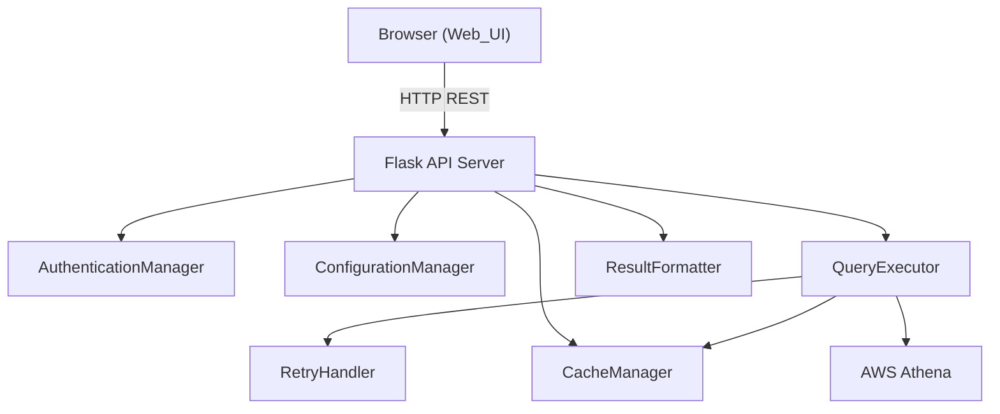

# Design Document: Web UI for Athena Query Tool

## Overview

This design adds a browser-based frontend to the existing Athena Query Tool CLI application. The architecture follows a thin API server pattern: a Python backend (using Flask) wraps the existing modules (`auth`, `config`, `executor`, `formatter`, `cache`, `retry`) and exposes them over HTTP REST endpoints. A single-page frontend built with vanilla HTML/CSS/JavaScript provides the user interface. The API server serves the frontend as static files from the same process, keeping deployment simple — one command starts both backend and frontend.

### Design Decisions

1. **Flask as the web framework**: Lightweight, minimal dependencies, well-suited for wrapping existing Python modules. No need for a heavier framework like Django since we're exposing a small number of endpoints.
2. **Vanilla JS frontend (no framework)**: The UI is simple enough (query editor, results table, config panel, export buttons) that a framework like React would be overkill. This keeps the dependency footprint minimal.
3. **Single-process serving**: The Flask server serves both the API endpoints and the static frontend assets. No separate frontend build step or server needed.
4. **JSON API contract**: All API responses use a consistent JSON envelope with `success`, `data`, and `error` fields for predictable client-side handling.

## Architecture



### Request Flow

1. User opens browser → Flask serves `index.html` and static assets
2. Frontend JS fetches `/api/config` on load → displays connection info
3. User writes SQL in Query_Editor, clicks Execute
4. Frontend POSTs to `/api/query` with `{ "sql": "..." }`
5. Flask validates request, calls `QueryExecutor.execute_query(sql)`
6. QueryExecutor checks cache, executes against Athena if needed, returns `QueryResult`
7. Flask serializes `QueryResult` to JSON response with columns, rows, row_count, and cache status
8. Frontend renders results in Results_Panel table
9. User clicks CSV/JSON export → frontend generates file client-side from the already-loaded result data

## Components and Interfaces

### Backend: Flask API Server (`athena_query_tool/web.py`)

New module that creates and configures the Flask application.

```python
def create_app(config_path: str) -> Flask:
    """Create and configure the Flask application.
    
    Args:
        config_path: Path to YAML configuration file
        
    Returns:
        Configured Flask app instance
    """
```

**Endpoints:**

| Method | Path | Description | Request Body | Response |
|--------|------|-------------|-------------|----------|
| GET | `/` | Serve the SPA index.html | — | HTML |
| GET | `/api/config` | Return current configuration | — | `{ "success": true, "data": { "region", "database", "workgroup" } }` |
| POST | `/api/query` | Execute SQL query | `{ "sql": "..." }` | `{ "success": true, "data": { "columns", "rows", "row_count", "from_cache" } }` |


**Error Response Format:**
```json
{
  "success": false,
  "error": "Descriptive error message"
}
```

**HTTP Status Codes:**
- `200` — Successful query or config retrieval
- `400` — Invalid request (missing `sql` field, empty query)
- `401` — Authentication failure (AWS credentials)
- `500` — Internal server error (unexpected failures)

### Backend: CLI Entry Point (`athena_query_tool/web_cli.py`)

New module providing the command-line entry point for the web server.

```python
def main():
    """Entry point: parse --config argument, load config, start Flask server."""
```

Uses `argparse` with a `--config` argument (defaults to `config.yaml`). Loads configuration via `ConfigurationManager.load_config()`, initializes `AuthenticationManager`, creates boto3 clients, sets up `QueryExecutor` (with optional `CacheManager`), and starts the Flask app.

### Frontend: Single-Page Application (`athena_query_tool/static/`)

```
athena_query_tool/static/
├── index.html      # Main HTML structure
├── style.css       # Styling
└── app.js          # Application logic
```

**`index.html`** — Contains:
- Configuration_Panel: displays region, database, workgroup
- Query_Editor: `<textarea>` for SQL input + Execute button
- Results_Panel: `<table>` for results + row count display + "No results" message
- Export buttons: CSV and JSON download buttons
- Error display area
- Loading indicator

**`app.js`** — Handles:
- `fetchConfig()` — GET `/api/config`, populate Configuration_Panel
- `executeQuery()` — POST `/api/query`, manage loading state, render results or errors
- `exportCSV()` — Generate CSV blob from current results, trigger download
- `exportJSON()` — Generate JSON blob from current results, trigger download
- UI state management (disable button during execution, show/hide loading indicator)

## Data Models

### API Request: Execute Query

```json
{
  "sql": "SELECT * FROM my_table LIMIT 10"
}
```

Validation: `sql` field must be present and be a non-empty string after trimming whitespace.

### API Response: Query Result

```json
{
  "success": true,
  "data": {
    "columns": [
      { "name": "col1", "type": "varchar" },
      { "name": "col2", "type": "integer" }
    ],
    "rows": [
      ["value1", "123"],
      ["value2", "456"]
    ],
    "row_count": 2,
    "from_cache": false
  }
}
```

Maps directly from the existing `QueryResult` dataclass:
- `columns` → from `QueryResult.columns` (list of `Column` with `name` and `type`)
- `rows` → from `QueryResult.rows` (list of lists)
- `row_count` → from `QueryResult.row_count`
- `from_cache` → boolean, determined by whether `CacheManager` returned a cached result

### API Response: Configuration

```json
{
  "success": true,
  "data": {
    "region": "us-east-1",
    "database": "my_database",
    "workgroup": "primary"
  }
}
```

Maps from existing `Config` dataclass:
- `region` → `Config.aws.region`
- `database` → `Config.athena.database`
- `workgroup` → `Config.athena.workgroup`

### API Response: Error

```json
{
  "success": false,
  "error": "Query failed: SYNTAX_ERROR: line 1:1: ..."
}
```

### CSV Export Format (Client-Side)

Generated by the frontend from the in-memory result data. First row contains column names, subsequent rows contain data values. Matches the format produced by `ResultFormatter.write_to_csv()`.

### JSON Export Format (Client-Side)

Generated by the frontend from the in-memory result data. Contains `columns`, `rows` (as objects keyed by column name), and `row_count`. Matches the structure produced by `ResultFormatter.write_to_json()`.


## Correctness Properties

*A property is a characteristic or behavior that should hold true across all valid executions of a system — essentially, a formal statement about what the system should do. Properties serve as the bridge between human-readable specifications and machine-verifiable correctness guarantees.*

### Property 1: QueryResult serialization completeness

*For any* `QueryResult` object (with arbitrary columns, rows, and row_count), serializing it to the API JSON response format must produce a JSON object containing: a `columns` array where each element has `name` and `type` fields matching the original Column objects, a `rows` array matching the original row data, a `row_count` integer matching the original count, and a `from_cache` boolean field.

**Validates: Requirements 2.1, 2.2, 8.3**

### Property 2: Error propagation

*For any* exception raised during query execution or authentication (with an arbitrary error message string), the API response must have `success` set to `false` and the `error` field must contain the original exception's message text.

**Validates: Requirements 2.5, 7.1**

### Property 3: Request validation rejects invalid input

*For any* request body that is missing the `sql` field, or where `sql` is empty, or where `sql` is composed entirely of whitespace, the API must return HTTP status 400 with a JSON error response.

**Validates: Requirements 7.4**

### Property 4: Configuration endpoint returns loaded values

*For any* valid configuration (with arbitrary region, database, and workgroup strings), the `/api/config` endpoint response must contain `region`, `database`, and `workgroup` fields whose values exactly match the loaded `Config` object's `aws.region`, `athena.database`, and `athena.workgroup` respectively.

**Validates: Requirements 6.1, 6.2, 6.3, 6.4**

### Property 5: CSV export format correctness

*For any* query result (with arbitrary column names and row data), the generated CSV string must have the column names as the first row (comma-separated), followed by one row per data row, with values matching the original data.

**Validates: Requirements 5.3**

### Property 6: JSON export format correctness

*For any* query result (with arbitrary columns and rows), the generated JSON export must parse to an object containing a `columns` array, a `rows` array (with objects keyed by column name), and a `row_count` field matching the actual number of rows.

**Validates: Requirements 5.4**

### Property 7: Results table rendering completeness

*For any* query result with at least one row, the rendered HTML table must contain all column names as header cells and all row values as data cells, and the displayed row count must equal the actual number of rows.

**Validates: Requirements 4.1, 4.2, 4.4**

## Error Handling

### Backend Error Handling

| Error Source | Exception Type | HTTP Status | Response |
|---|---|---|---|
| Missing/empty `sql` in request | — | 400 | `{ "success": false, "error": "Missing or empty 'sql' field" }` |
| Non-JSON request body | — | 400 | `{ "success": false, "error": "Request must be JSON" }` |
| AWS authentication failure | `AuthenticationError` | 401 | `{ "success": false, "error": "<auth error message>" }` |
| Query execution failure | `QueryExecutionError` | 500 | `{ "success": false, "error": "<query error message>" }` |
| Configuration load failure | `ConfigurationError` | — | Log error, exit with non-zero status (startup only) |
| Unexpected errors | `Exception` | 500 | `{ "success": false, "error": "Internal server error" }` |

The Flask app registers error handlers for each custom exception type from `athena_query_tool/exceptions.py`. All API error responses use the consistent `{ "success": false, "error": "..." }` envelope.

### Frontend Error Handling

| Scenario | Behavior |
|---|---|
| Network error (fetch fails) | Display "Connection error: unable to reach the server" in the error display area |
| API returns error response (`success: false`) | Display the `error` message from the response |
| Empty results (`row_count: 0`) | Show "No results returned" message in Results_Panel |
| Export with no results loaded | Export buttons are hidden/disabled when no results are available |

### Startup Error Handling

If `ConfigurationManager.load_config()` raises `ConfigurationError` during startup, the server logs the error message and exits with status code 1. This matches the existing CLI behavior.

## Testing Strategy

### Dual Testing Approach

Both unit tests and property-based tests are used:

- **Unit tests**: Verify specific examples, edge cases, integration points, and UI behavior
- **Property-based tests**: Verify universal properties across randomly generated inputs

### Property-Based Testing

**Library**: `hypothesis` (already in `requirements.txt`)

**Configuration**: Each property test runs a minimum of 100 examples.

**Tag format**: Each test includes a comment: `# Feature: web-ui, Property {number}: {property_text}`

Each correctness property (1–7) maps to exactly one property-based test function.

**Generators needed**:
- `QueryResult` generator: random column names/types, random row data, consistent row_count
- `Config` generator: random region/database/workgroup strings
- Error message generator: random non-empty strings
- Invalid request body generator: missing fields, empty strings, whitespace-only strings

### Unit Tests

Unit tests cover:
- **Startup**: Config loading, `--config` argument parsing, exit on bad config
- **Static serving**: GET `/` returns HTML, static assets are served
- **Query execution flow**: POST `/api/query` calls executor, returns results
- **Cache integration**: CacheManager used when enabled, `from_cache` flag set correctly
- **UI elements**: Textarea, submit button, export buttons present in HTML
- **Loading state**: Submit button disabled during execution
- **Error display**: Error messages shown in UI on failure
- **Zero results**: "No results" message displayed
- **Connection error**: Frontend handles fetch failure gracefully

### Test File Structure

```
tests/
├── test_web.py           # Backend API unit + property tests
└── test_web_frontend.py  # Frontend behavior tests (if using a DOM testing approach)
```

Since the frontend is vanilla JS, frontend-specific tests (UI state, DOM rendering) can be tested via integration tests that check the served HTML structure, or via a lightweight JS test runner. The property tests focus on the backend serialization and API contract, which is where the core logic lives.
